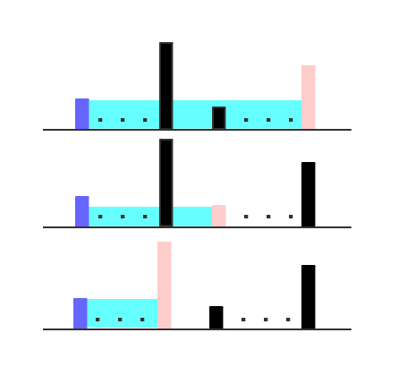

# 011.盛最多水的容器

## **问题描述**  

给定 n 个非负整数 a1，a2，...，an，每个数代表坐标中的一个点 (i, ai) 。在坐标内画 n 条垂直线，垂直线 i 的两个端点分别为 (i, ai) 和 (i, 0)。找出其中的两条线，使得它们与 x 轴共同构成的容器可以容纳最多的水。  

**说明**：你不能倾斜容器，且 n 的值至少为 2。  


图中垂直线代表输入数组 [1,8,6,2,5,4,8,3,7]。在此情况下，容器能够容纳水（表示为蓝色部分）的最大值为 49。

**示例**：  
输入: [1,8,6,2,5,4,8,3,7]  
输出: 49  

## **解决方案**

&emsp;&emsp;这题大概有两种思路，第一种是直接做两次循环，暴力搜索，时间复杂度大概是`O（n^2)`，在这里就不展开了，下面讲第二种思路，用到了双指针。  
&emsp;&emsp;首先，展示一张帮助理解的图。



&emsp;&emsp;如图所示，我们假设height数组最左边的边的长度小于最右边的边的长度（如果相反，只需要当镜像处理即可）。这样，当我们固定紫边不动的时候，无论怎么选择右边的边界，面积是永远不会大于图中第一种情况的。  
&emsp;&emsp;基于上面讲的理论，当我们固定短边的时候，最大面积是一个已知的状态。所以，有可能增大面积的方式就是短边向长边的方向移动。  
&emsp;&emsp;这样不断计算移动后的局部最大面积，直到短边和长边重合，此时虽然时间复杂度只有`O(n)`，但是每一次移动都计算了所有的局部最大面积，所以最后记录的最大面积即为全局的最大容量。

```java
class Solution {
    public int maxArea(int[] height) {
        int len=height.length;
        int left=0,right=len-1;
        int max=0;
        while (left<right){
            if (height[left]<height[right]){
                int temp=height[left]*(right-left);
                if (temp>max) max=temp;
                left++;
            }else{
                int temp=height[right]*(right-left);
                if (temp>max) max=temp;
                right--;
            }
        }
        return max;
    }
}
```