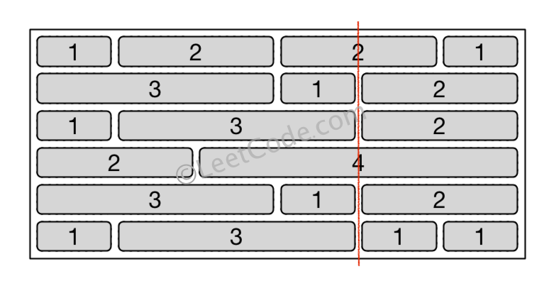

# 554.砖墙

## 问题描述

你的面前有一堵方形的、由多行砖块组成的砖墙。 这些砖块高度相同但是宽度不同。你现在要画一条自顶向下的、穿过最少砖块的垂线。

砖墙由行的列表表示。 每一行都是一个代表从左至右每块砖的宽度的整数列表。

如果你画的线只是从砖块的边缘经过，就不算穿过这块砖。你需要找出怎样画才能使这条线穿过的砖块数量最少，并且返回穿过的砖块数量。

你不能沿着墙的两个垂直边缘之一画线，这样显然是没有穿过一块砖的。

### 示例

```c
输入: [[1,2,2,1],
      [3,1,2],
      [1,3,2],
      [2,4],
      [3,1,2],
      [1,3,1,1]]

输出: 2
```

### 解释



### 提示

1. 每一行砖块的宽度之和应该相等，并且不能超过 INT_MAX。  
2. 每一行砖块的数量在 [1,10,000] 范围内， 墙的高度在 [1,10,000] 范围内， 总的砖块数量不超过 20,

## 解决方案

可以看出，这一题其实是在问墙缝边缘最多的点有多少个，然后用总砖行数减去最多的边缘数即可。

```java
class Solution {
    public int leastBricks(List<List<Integer>> wall) {
        HashMap<Integer,Integer> hmap=new HashMap<>();
        int max=0;
        for (List<Integer> row : wall) {
            int index = 0;
            for (int i=0;i<row.size()-1;i++) {
                index += row.get(i);
                hmap.put(index, hmap.getOrDefault(index, 0) + 1);
                if (hmap.get(index)>max) max=hmap.get(index);
            }
        }
        return wall.size()-max;
    }
}
```
